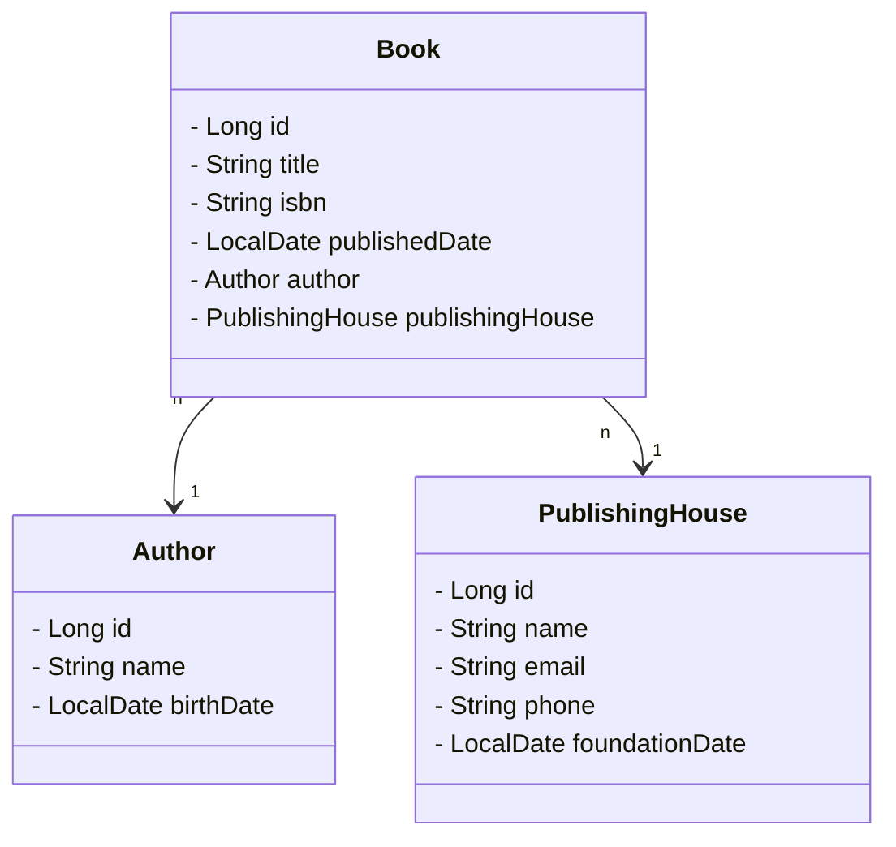

# Santander Bootcamp 2024 Java - Backend
Repositório dedicado à solução do desafio final do bootcamp "Santander 2024 - Backend com Java" proposto na seção "Ganhando Produtividade no Java com Spring Framework".

## Diagrama de Classes (Domínio da API - Sistema de Gerenciamento de Biblioteca)

